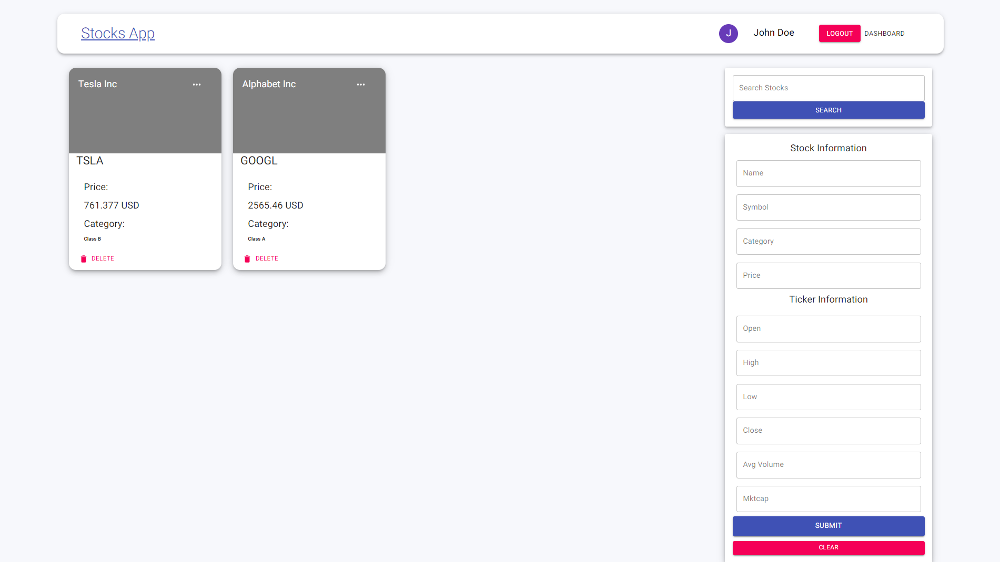
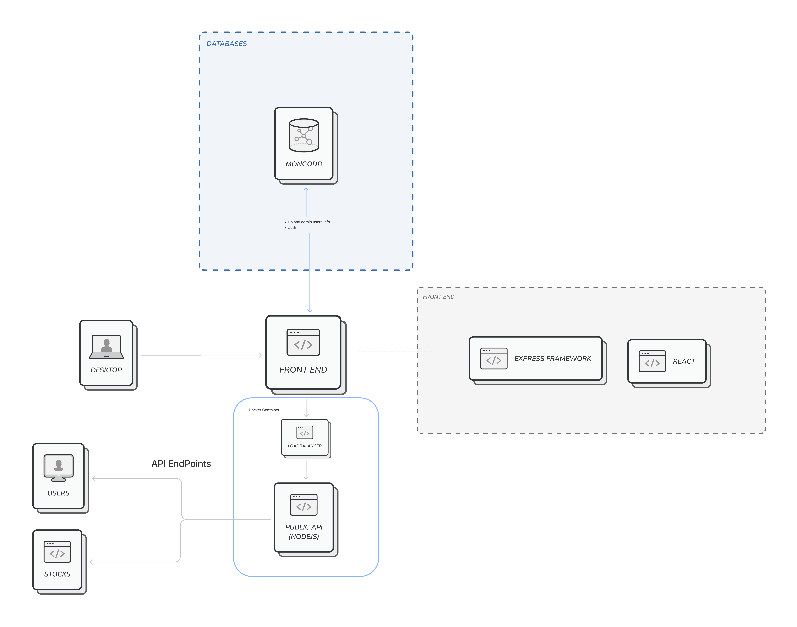
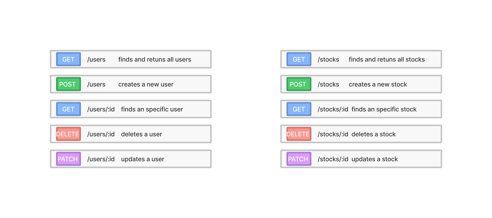
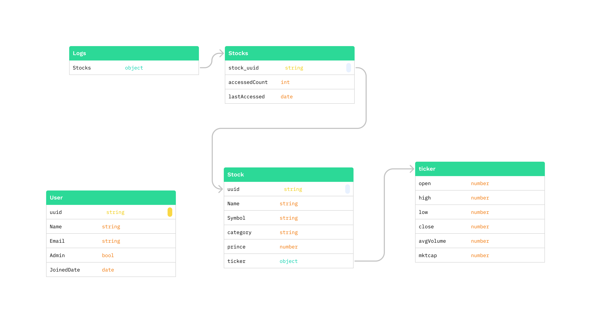
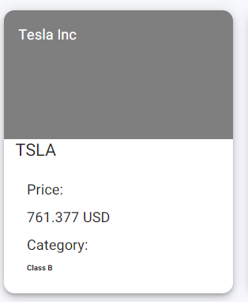
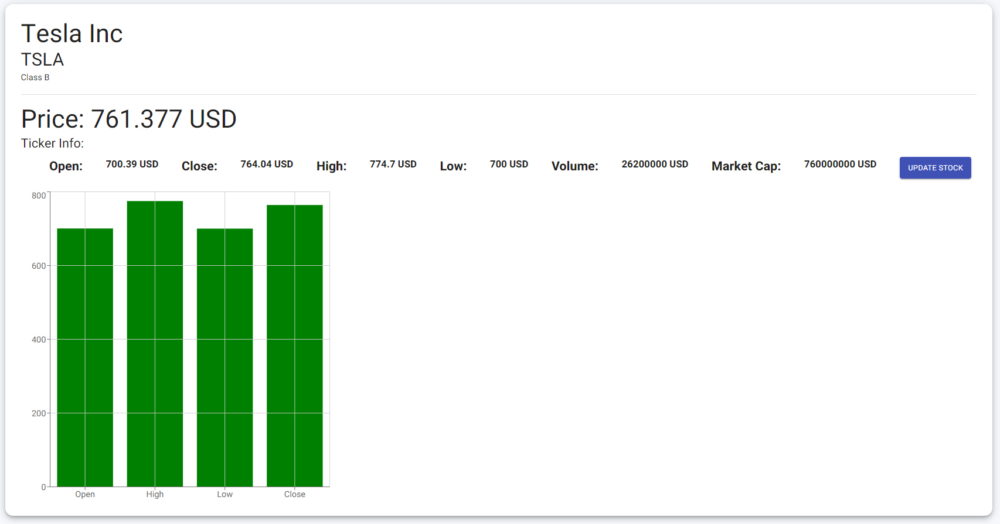
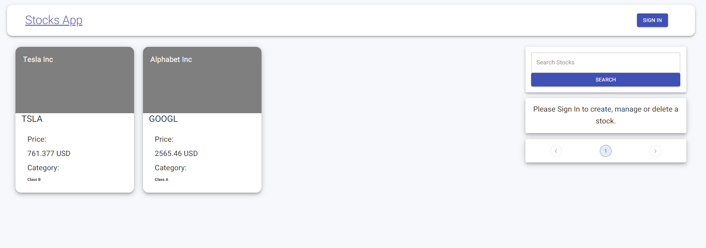
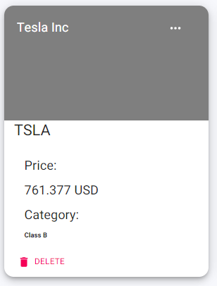
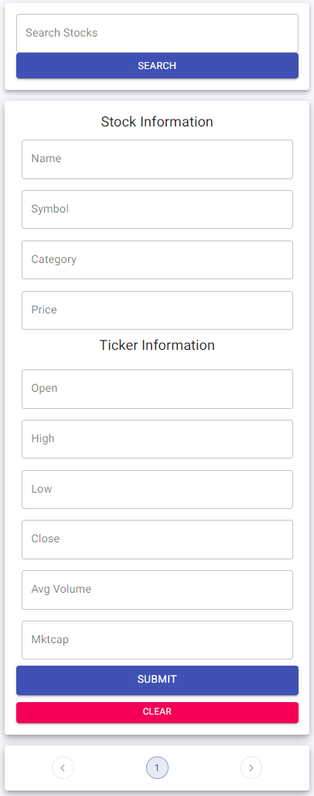
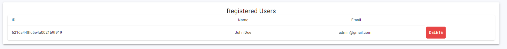

# Stocks App
----------------------------------------------------------------
## Developers
Patricio Tena Zozaya - 
https://github.com/tenapato

## Description of the app
Basic catalog system to manage stock information.

>Refer to App specifications for more information about each component
---
## Architecture

The proposed architecture is based on a MERN Fullstack app.
MERN meaning the following:
- M: MongoDB for the database
- E: Express
- ReactJS:  Used to build the front end
- NodeJS: Used to build the API


* Note: The project folder structed was built using best practices for scalability in the future.
---
## API / Server / Database

The server architecture is as follows:

```
- / 			        # Project Root
    - Controllers       # Folder with functions to manage data from the database
    - Middleware        # Contains files to authenticate admin users
    - Models            # Folder containing database models for admin users and stocks
    - Routes:           # Folder containing api endpoint routes

```   
### Api Endpoints


### Sample structures

Stocks (Minimal data was used for demonstration purposes)

    const stockSchema = mongoose.Schema({
        name: String,
        symbol: String,
        category: String,
        price: Number,
        open: Number,
        high: Number,
        low: Number,
        close: Number,
        avgVolume: Number,
        mktcap: Number,
        
    })

Admin users

    const userSchema = mongoose.Schema({
        name: { type: String, required:  true },
        email: { type: String, required: true },
        password: { type: String, required: true },
        id: { type: String },
        admin: { 
            type: String,
            default: null,
        }
    });

Logs

    const logsSchema = mongoose.Schema({
        stocks: [
            {
                stock_uuid: String, 
                accesedCount: {type: String, default: 0},
                lastAccesed: {type: Date}
            },
            [...]
        ]  
    });

### Sample db conection string

    mongoose.connect(process.env.CONNECTION_URL, { useNewUrlParser: true,   useUnifiedTopology: true })
    .then(() => app.listen(PORT, () => console.log(`Server Running on Port: http://localhost:${PORT}`)))
    .catch((error) => console.log(`${error} did not connect`));

    mongoose.set('useFindAndModify', false);

Where `Port` and `CONECTION_URL` come from a .env file
* Refere to `.env-example` for more info.

---
## Database Design


Mongo DB was used as the primary database with a custom authentication method that uses JSON web tokens.

>In the future it may be viable to implement Firebase authentication and keep MongoDB just to store persistent data. 
---
## How to run

1. First open two terminals and cd into the client and server directories
2. run the following command to install all needed Dependencies

        npm install 
3. Run both the server and the client

        npm start
* Note: you will have to add your own mongodb cluster connection url in order to run this project. Refer to  `Sample db conection string`  section for more info
---
## How to run using Docker

1. Change into the porject directory
        
* Note: To run this project with docker-compose, jump to step `6` 
2. Open a terminal and CD into *Client* and build the image

        docker build --tag client .
3. Start the container assigning it port 3000

        docker run -p 3000:3000 client
4. Open a terminal and CD into *Server* and build the image

        docker build --tag server .
5. Start the container assigning it port 5000 (use port 80 if you want to use the lode balancer)

        docker run -p 5000:5000 server
*From now on, you just have to connect normaly to the application in: `http://localhost:3000`

6. Build the image using docker-compose

        docker-compose build 
7. Start the containers

        docker-compose up
8. To run the application using a load balancer:
        
        docker-compose up --scale server=3
    > Where '3' is the number of servers to run
9. Connect to the client: `http://localhost:3000`
10. Tu turn of the containers

        docker-compose down
> Note: in this test version, the admin user is `admin@gmail.com` , password: `admin`
---

## App specifications

- Each stock information is displayed in the following format: </br>

- You can click on them to display more information:</br>

- If you are not signed in as an admmin user, you cannot add stocks nor manage other users</br>

- When you are signed in, stock information will change a little bit</br>

> Buttons for deleting of updating the stock information will appear
- Form input for stocks looks as follows:</br>

- Admin dashboard for users looks as follows</br>
